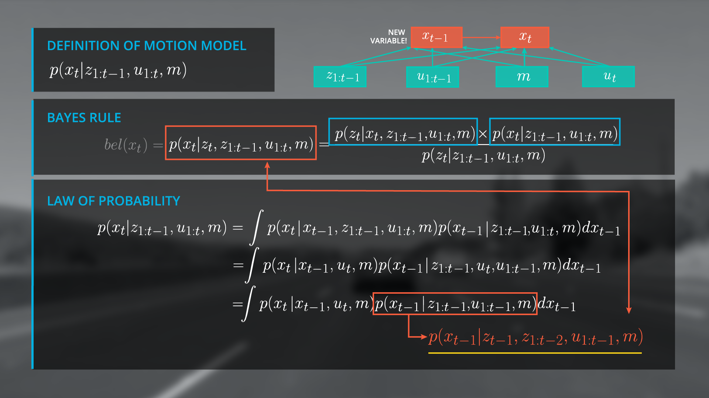
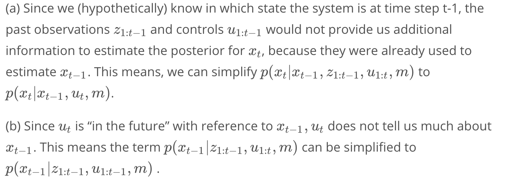
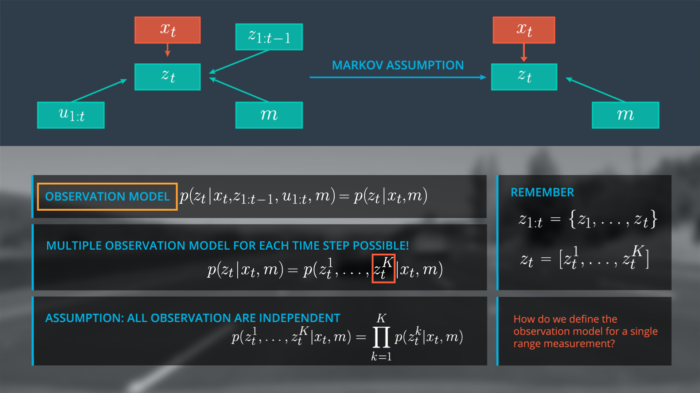

# Markov filter && Particle filter

**最为一般的模型，其他模型均有此衍生**

_下文图片来源udacity_

各个字母代表含义如下：
1. $x_{t}$ :表示车辆或者自身的状态，是一个向量
2. $z_{1:t}$ :1-t时间的观测量
3. $u_{1:t}$ :1-t时间内的控制量，速度，角速度等(yaw_rate)
4. $m$ :地图信息，若地图信息不确定，则为SLAM问题，需要同时定位和建图

## 1. 最一般的定位模型
根据贝叶斯公式$P\left ( a|b \right )=\frac{P\left ( b|a \right )P\left ( a \right )}{P\left ( b \right )}$ ，有如下部分：
1. $P\left ( a \right )$，运动模型，prior
2. $P\left ( b|a \right )$，观测模型，likelihood
3. $P\left ( b \right )$ ，用来归一化项，可以根据左右a下观测到的b计算
4. $P\left ( a|b \right )$，后验概率，修正的位置

更具体的说就是：
1. $P(location∣observation)$: This is $P(a|b)$, the normalized probability of a position given an observation (posterior).
2. $P(observation∣location)$: This is $P(b|a)$, the probability of an observation given a position (likelihood)
3. $P(location)P(location)$: This is $P(a)$, the prior probability of a position
4. $P(observation)$: This is $P(b)$, the total probability of an observation

贝叶斯滤波的形式如下图：

其中的运动模型是前一时刻所有可能的状态运动到当前状态$x_{t}$的概率和，利用全概率公式求解，发现会产生一个递归问题。
> 这里的积分其实是卷积的一种形式，需要阅读概率机器人

如上图，便可以在运动模型中推导出马尔科夫假设，当前状态只和前一时刻状态以及在这时刻的运动信息有关，和之前的状态独立。因为之前的信息已经在计算上一时刻状态时使用。

## 2. Markov Assumption
更一般地，根据上面的事实，列出马尔科夫假设：

## 3. Observation Model
根据马尔科夫假设，可以将观测模型也简化。观测信息只和当前状态和地图信息有关。

## 4. 整个贝叶斯滤波器
贝叶斯滤波器是最为一般的模型，再添加限制条件后可简化为卡尔曼滤波，粒子滤波等。

模型主要计算三部分：
1. motion model:卷积，根据运动信息计算状态位置
2. observation model：基于某个特定位置，观测到不用路标信息，最后概率相乘。
3. 归一化项$\eta$，在某个位置$x_{t}^{i}$ 观测到$z_{t}$的所有情形，全概率公式

整个滤波器的运作方式如下，我们要做的应该就是根据当前接收到的传感器信息，不断地预测和更新信息。
